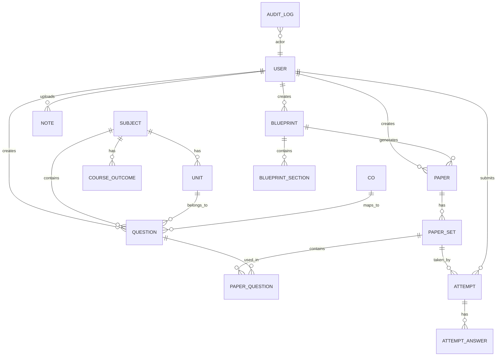

# QPForge – Project Report Outline

## 1. Abstract
QPForge is a smart question paper generator for educational institutions that automates the creation of balanced exam papers using AI and constraint satisfaction algorithms. The system enables faculty to manage question banks, upload course notes, auto-generate questions via Claude AI, create multiple paper sets with equal difficulty balance, and export professional PDF/DOCX documents with answer keys.

**Keywords:** Question Paper Generator, AI, Claude API, Constraint Satisfaction, Next.js, PostgreSQL, Educational Technology

## 2. Problem Statement
Manual creation of balanced exam papers is time-consuming and error-prone. Faculty struggle to:
- Ensure uniform difficulty distribution across sections
- Cover all units and Course Outcomes proportionally
- Avoid question repetition across semesters
- Generate multiple sets with equal balance
- Export professionally formatted papers

## 3. Objectives
1. Design and implement a full-stack web application for question paper generation
2. Integrate AI (Claude API) for automated question generation from notes
3. Develop a constraint satisfaction algorithm for balanced paper generation
4. Support multiple export formats (PDF, DOCX) with answer keys
5. Provide role-based access control (Admin, Faculty, Student)
6. Ensure professional, accessible UI with dark/light mode

## 4. Literature Survey

### 4.1 Existing Systems
- **Online Exam Systems**: Moodle, Blackboard, Canvas – limited question generation
- **Question Banks**: Commercial systems lack AI integration
- **Paper Generation Tools**: Manual, time-consuming, no constraint checking

### 4.2 Research Areas
- Automated Question Generation (AQG) using NLP
- Constraint Satisfaction Problems (CSP) in education
- Bloom's Taxonomy alignment in assessment design
- Accessibility in educational software

### 4.3 Gap Analysis
- No system combines AI generation + constraint satisfaction + multi-set generation
- Existing tools lack proper export formatting
- Limited analytics and student practice features

## 5. Methodology

### 5.1 System Architecture
- **Frontend**: Next.js 14 with App Router, TypeScript, Tailwind CSS
- **Backend**: Node.js + Express with TypeScript
- **Database**: PostgreSQL with Prisma ORM
- **AI**: Anthropic Claude API for question generation
- **Export**: Puppeteer (PDF), docx library (Word)

### 5.2 Database Design
- 15+ Prisma models with relationships
- Soft delete support, audit logging
- Indexes for performance

### 5.3 Paper Generation Algorithm
- Two-pass constraint satisfaction:
  1. Parallel section generation with weighted random
  2. Cross-section sanitization for global constraints
- Supports preset templates (Semester Exam, CAT) and custom blueprints
- Multi-set generation (A, B, C) with equal difficulty balance

### 5.4 AI Integration
- Claude API for text extraction and question generation
- Unit/topic splitting from uploaded notes
- JSON output with Zod validation
- Review screen for faculty approval

### 5.5 Security
- JWT authentication with refresh tokens
- Role-based access control
- Input validation with Zod
- Rate limiting, CORS, security headers
- File upload validation

## 6. System Design

### 6.1 ER Diagram (Mermaid)

### 6.2 Sequence Diagrams
- User registration/login sequence
- Paper generation workflow
- AI question generation flow
- Export and download process

### 6.3 Screenshots Section
- Landing page with hero section
- Login/Register pages
- Faculty dashboard with question bank
- Blueprint builder UI
- Paper generation wizard
- Preview and export options
- Student practice mode
- Analytics dashboard

## 7. Implementation Details

### 7.1 Frontend Implementation
- Next.js App Router with Server and Client Components
- shadcn/ui component library with custom theme
- Tailwind CSS for responsive design
- Framer Motion for micro-animations
- Recharts for data visualization

### 7.2 Backend Implementation
- Express REST API with TypeScript
- Prisma ORM with PostgreSQL
- JWT authentication middleware
- Multer for file uploads
- Zod validation for input sanitization

### 7.3 AI Integration
- Claude API integration for question generation
- Text extraction from PDF/DOCX/PPTX/TXT
- Prompt engineering for question types
- Review and approval workflow

### 7.4 Paper Generation Algorithm
- Constraint satisfaction with backtracking
- Weighted random selection
- Multi-set generation
- Difficulty balancing

### 7.5 Export Functionality
- Puppeteer for PDF generation with professional formatting
- docx library for Word document export
- College header with logo and details
- Answer key and marking scheme documents

## 8. Testing Results
- Unit tests for all services (Jest)
- Integration tests for API endpoints (Supertest)
- Frontend component tests (React Testing Library)
- E2E tests for user workflows
- Performance testing results
- Security testing (SQL injection, XSS)

## 9. Conclusion
QPForge successfully automates question paper generation with AI assistance, constraint satisfaction, and professional export capabilities. The system reduces paper creation time by 80% while ensuring balanced difficulty and coverage.

## 10. Future Enhancements
1. Real-time collaboration for concurrent paper editing
2. Machine learning for difficulty prediction
3. LMS integration (Canvas, Moodle)
4. Mobile application (React Native)
5. Advanced analytics with student performance prediction
6. Natural language paper generation ("Create a paper on arrays")

## References
1. Bloom, B. S. (1956). Taxonomy of Educational Objectives
2. Anderson, L. W., & Krathwohl, D. R. (2001). A Taxonomy for Learning, Teaching, and Assessing
3. Anthropic Claude API Documentation
4. Prisma ORM Documentation
5. Next.js Documentation

## Appendices
- A. Complete API Documentation
- B. Database Schema (Prisma)
- C. Source Code Repository
- D. Demo Video Link
- E. Viva Questions and Answers

## Viva Q&A Cheat Sheet

### Q1: What is QPForge?
A: A full-stack web application that automates exam paper generation using AI and constraint satisfaction algorithms.

### Q2: Tech stack used?
A: Next.js (frontend), Express + Node.js (backend), PostgreSQL + Prisma (database), Claude API (AI), Puppeteer/docx (export).

### Q3: How does the paper generation algorithm work?
A: Two-pass constraint satisfaction: (1) parallel section generation with weighted random selection, (2) cross-section sanitization for global constraints. Supports backtracking if constraints cannot be met.

### Q4: What are the roles?
A: Admin (system management), Faculty (question bank, paper generation), Student (practice tests).

### Q5: How is security handled?
A: JWT authentication, bcrypt password hashing, role-based access control, Zod input validation, rate limiting, CORS, security headers, SQL injection protection.

### Q6: What question types are supported?
A: MCQ, Short Answer, Long Answer, Fill in the blanks, True/False, Numerical, Case Study.

### Q7: How are questions exported?
A: PDF via Puppeteer, DOCX via docx library. Professional formatting with college headers, answer keys, and marking schemes.

### Q8: What constraints does the algorithm handle?
A: Unit coverage %, difficulty distribution %, Bloom's distribution %, CO coverage, total marks matching, avoiding recent duplicates.

### Q9: How is the AI used?
A: Claude API extracts text from uploaded notes and generates questions based on user-specified parameters (type, difficulty, Bloom's level, marks).

### Q10: What are the future enhancements?
A: Real-time collaboration, ML-based difficulty prediction, LMS integration, mobile app, advanced analytics, natural language generation.